Northem Light - IntelliJ IDEA Syntax
====================================

### Description
A north-bluish light theme based on the same named [color palette](https://github.com/arcticicestudio/northem) designed by [Arctic Ice Studio](http://arcticicestudio.com).
This is a light and more color-intensive variation.

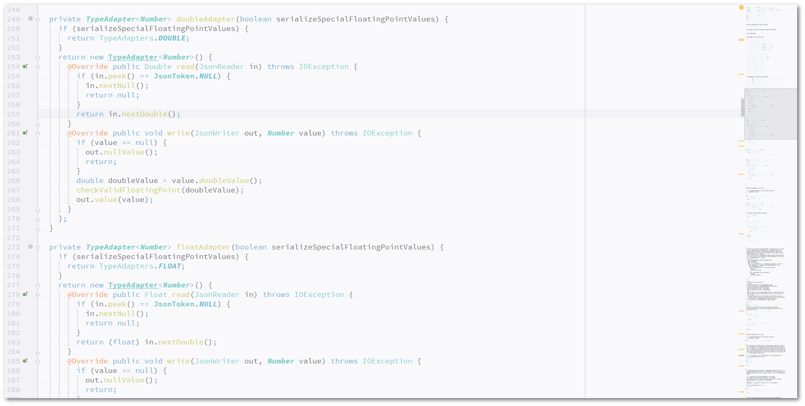

### Variations
Also available as:
  - <a href="northem-intellij-idea-syntax"> Northem IntelliJ IDEA Syntax</a>    
  - <a href="northem-dark-intellij-idea-syntax"> Northem Dark IntelliJ IDEA Syntax</a>    

Also stay tuned for the <a href="#"> Northem Light - IntelliJ IDEA UI</a> (in drafting)!

### Other Projects
  - <a href="https://github.com/arcticicestudio/northem-light-atom-syntax"> Northem Light Atom Syntax</a>    
  - <a href="https://github.com/arcticicestudio/northem-light-atom-ui"> Northem Light Atom UI</a>    
  - <a href="https://github.com/arcticicestudio/northem-light-eclipse-syntax"> Northem Light Eclipse Syntax</a>   
  - <a href="https://github.com/arcticicestudio/northem-light-gedit"> Northem Light gedit</a> 
  - <a href="#"> Northem Light GTK</a> (in drafting)  
  - <a href="https://github.com/arcticicestudio/northem-light-notepadplusplus"> Northem Light Notepad++</a>  

Visit the [official website](http://arcticicestudio.com/northem) (actually under construction) for more information.

### Global Settings
  - Console Console
  - Console Font
  - Custom
  - Debugger
  - File Status
  - Font
  - General
  - Language Defaults

### Default Languages
  - [Android Logcat](http://developer.android.com/tools/help/logcat.html)
  - [Diff](http://pubs.opengroup.org/onlinepubs/9699919799/utilities/diff.html)
  - [Groovy](http://www.groovy-lang.org)
  - [HTML](http://www.w3.org/TR/html5)
  - [Java](www.oracle.com/technetwork/java/javase)
  - [JSON](http://www.json.org)
  - [Properties](https://en.wikipedia.org/wiki/.properties)
  - [RegExp](https://en.wikipedia.org/wiki/Regular_expression)
  - [XML](http://www.w3.org/TR/xml)

### Plugin Support
  - [.ignore](https://plugins.jetbrains.com/plugin/7495)
  - [Apache Avro IDL](https://plugins.jetbrains.com/plugin/7971)
  - [Apache config (.htaccess) support](https://plugins.jetbrains.com/plugin/6834)
  - [BashSupport](https://plugins.jetbrains.com/plugin/4230)
  - [Batch Scripts Support](https://plugins.jetbrains.com/plugin/265)
  - [C / C++](https://plugins.jetbrains.com/plugin/1373)
  - [La Clojure](https://plugins.jetbrains.com/plugin/4050)
  - [Dart](https://plugins.jetbrains.com/plugin/6351)
  - [Erlang](https://plugins.jetbrains.com/plugin/7083)
  - [GLSL Support](https://plugins.jetbrains.com/plugin/6993)
  - [Go](https://plugins.jetbrains.com/plugin/5047)
  - [Handlebars/Mustache](https://plugins.jetbrains.com/plugin/6884)
  - [Haxe Support](https://plugins.jetbrains.com/plugin/6873)
  - [Kotlin](https://plugins.jetbrains.com/plugin/6954)
  - [LaTeX](https://plugins.jetbrains.com/plugin/7660)
  - [Lua](https://plugins.jetbrains.com/plugin/5055)
  - [Markdown Support](https://plugins.jetbrains.com/plugin/7793)
  - [Puppet Support](https://plugins.jetbrains.com/plugin/7180)
  - [Python Community Edition](https://plugins.jetbrains.com/plugin/7322)
  - [ReStructuredText Support](https://plugins.jetbrains.com/plugin/7124)
  - [Scala](https://plugins.jetbrains.com/plugin/1347)
  - [TYPO3 TypoScript Support](https://plugins.jetbrains.com/plugin/6965)
  - [YAML/Ansible support](https://plugins.jetbrains.com/plugin/7792)

### Version
[`-`](https://github.com/arcticicestudio/northem-light-intellij-idea-syntax/releases/latest)

Supported IntelliJ IDEA Community Editions: `15.0.x`, `14.1.x`

For older versions check out the [GitHub Repository](https://github.com/arcticicestudio/northem-light-intellij-idea-syntax) or [official website](http://arcticicestudio.com/northem) (actually under construction).

### Changelog
[`-`](CHANGELOG.md)

### Installation
Download and install the required font, read section [Dependencies](#Dependencies) for more information.

Install the theme via the *Import Settings* option
  - *Configure* > *Import Settings* on the Welcome Screen
  or
  - *File* > *Import Settings* while in the IDE Project Mode

Alternatively install it manually by copying the file to the `colors` folder located inside of your IntelliJ IDEA `config` folder (`$IDEA_HOME/colors`).
Read the official [documentation](https://www.jetbrains.com/idea/help/project-and-ide-settings.ht.) for more information about folder locations.

Activate it by going to the *Settings* > *Colors & Fonts* section and select `Northem Light` from the *Scheme* drop-down menu.

### Screenshots
#### Bash
[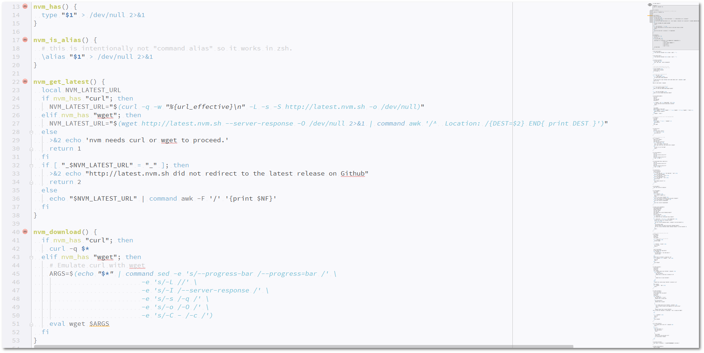](https://raw.githubusercontent.com/arcticicestudio/northem-light-intellij-idea-syntax/master/src/main/assets/media/preview-screenshot-bash.png)

#### C
[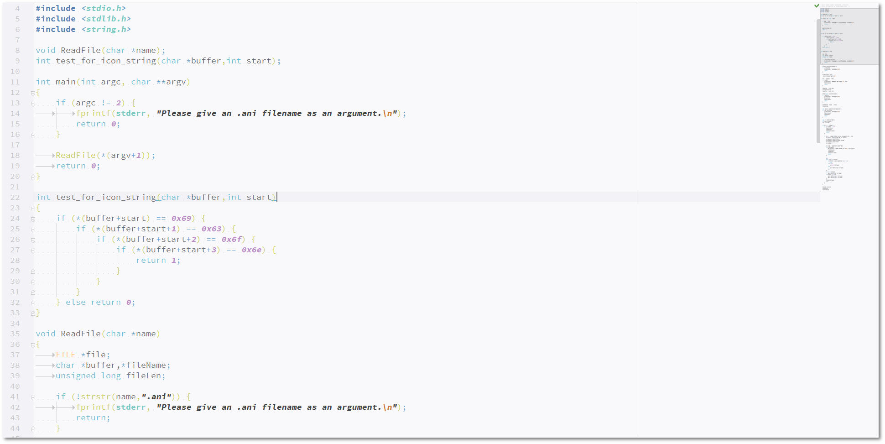](https://raw.githubusercontent.com/arcticicestudio/northem-light-intellij-idea-syntax/master/src/main/assets/media/preview-screenshot-c.png)

#### C++
[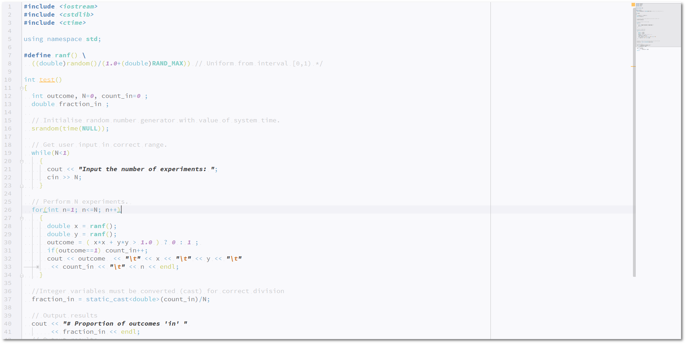](https://raw.githubusercontent.com/arcticicestudio/northem-light-intellij-idea-syntax/master/src/main/assets/media/preview-screenshot-cpp.png)

#### GLSL
[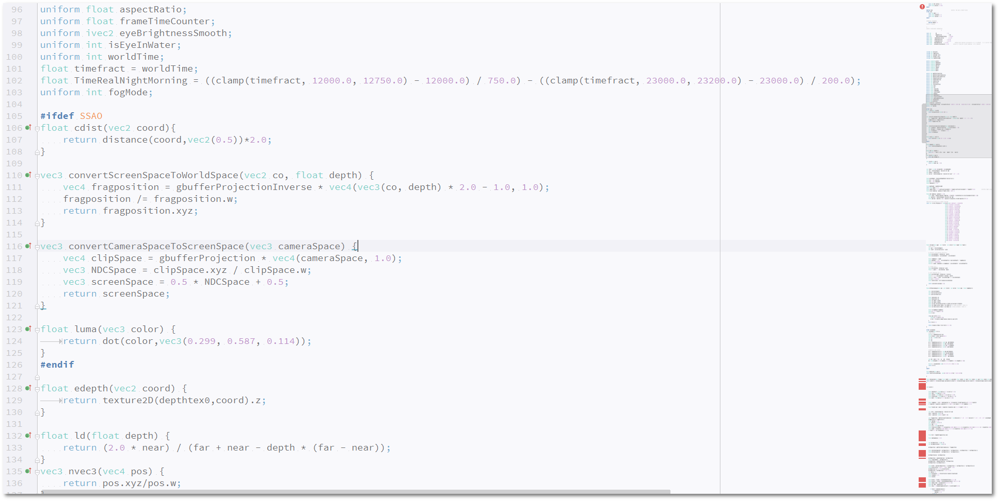](https://raw.githubusercontent.com/arcticicestudio/northem-light-intellij-idea-syntax/master/src/main/assets/media/preview-screenshot-glsl.png)

#### Go
[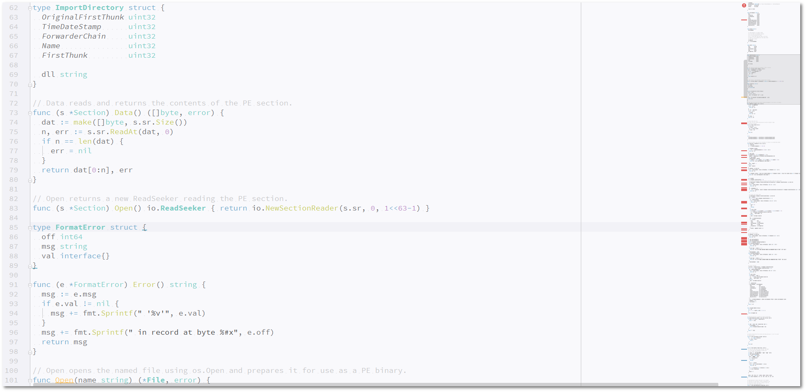](https://raw.githubusercontent.com/arcticicestudio/northem-light-intellij-idea-syntax/master/src/main/assets/media/preview-screenshot-go.png)

#### HTML
[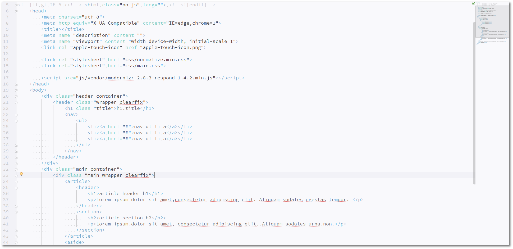](https://raw.githubusercontent.com/arcticicestudio/northem-light-intellij-idea-syntax/master/src/main/assets/media/preview-screenshot-html.png)

#### Java

#### JSON

#### Markdown
[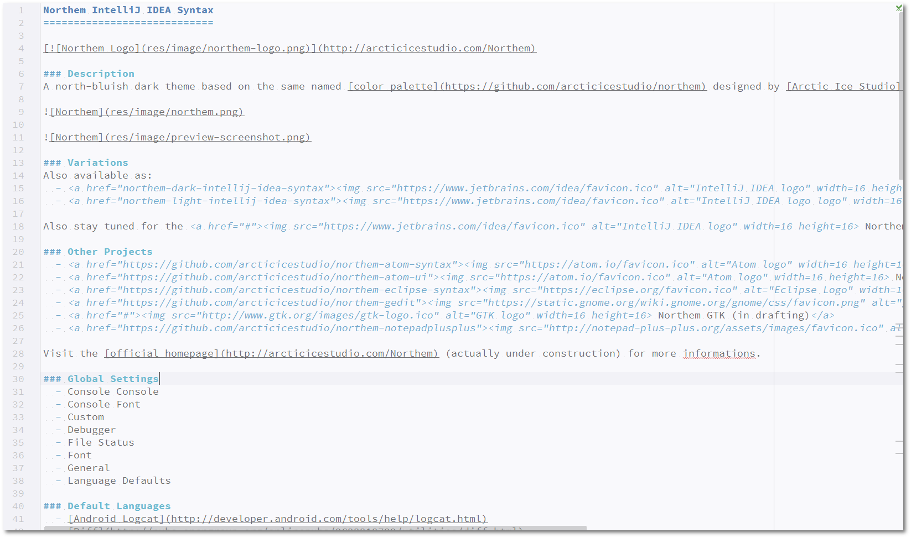](https://raw.githubusercontent.com/arcticicestudio/northem-light-intellij-idea-syntax/master/src/main/assets/media/preview-screenshot-markdown.png)

#### Python
[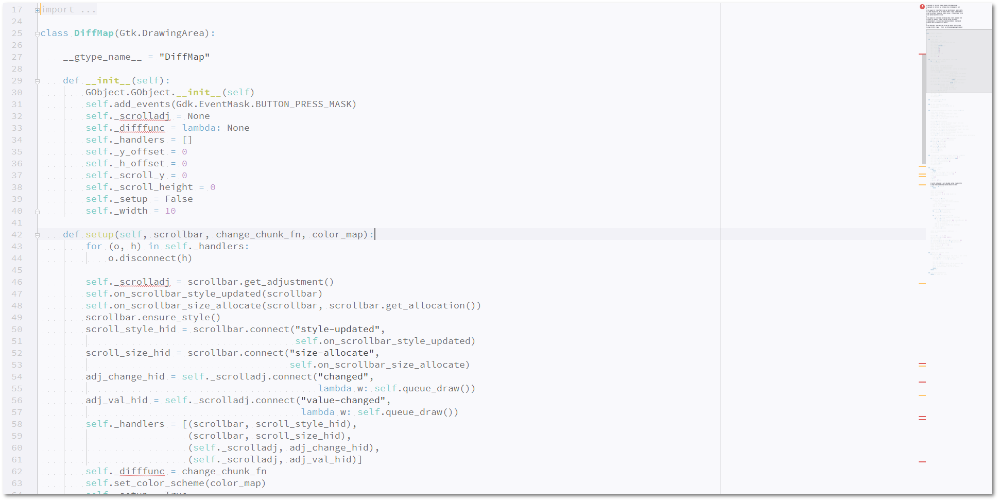](https://raw.githubusercontent.com/arcticicestudio/northem-light-intellij-idea-syntax/master/src/main/assets/media/preview-screenshot-python.png)

#### ReStX (ReStructured Text)
[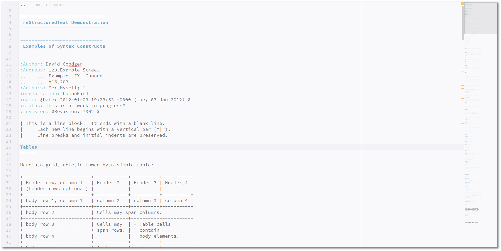](https://raw.githubusercontent.com/arcticicestudio/northem-light-intellij-idea-syntax/master/src/main/assets/media/preview-screenshot-restx.png)

#### Scala

#### XML
[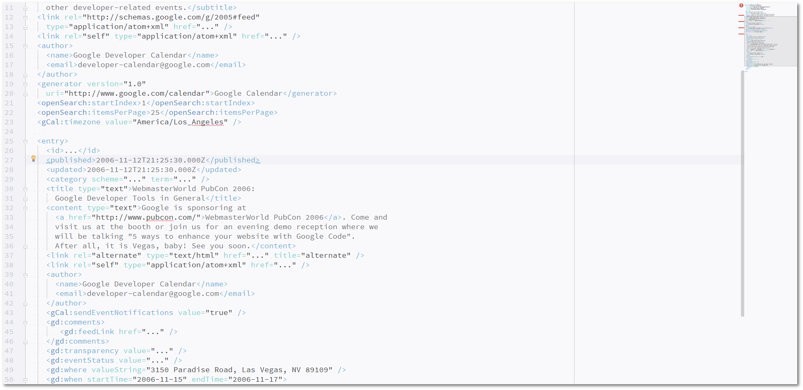](https://raw.githubusercontent.com/arcticicestudio/northem-light-intellij-idea-syntax/master/src/main/assets/media/preview-screenshot-xml.png)

### Development
#### Workflow
This project follows the [gitflow](http://nvie.com/posts/a-successful-git-branching-model) branching model.

#### Specifications
This project follows the [Arctic Versioning Specification (ArcVer)](https://github.com/arcticicestudio/arcver).

### Dependencies
This theme requires the Open Source font [Source Code Pro](https://typekit.com/fonts/source-code-pro)
Visit the [GitHub Repository](https://github.com/adobe-fonts/source-code-pro) for more information.

#### Production
**Engines**
  - [`idea@15.0.5`](https://www.jetbrains.com/idea)

#### Development
  - [`northem-light@1.0.2`](https://github.com/arcticicestudio/northem-light)

**Engines**
  - [`git@2.8.*`](https://git-scm.com)

**Skeletons**
  - [`glacier-git@0.22.0`](https://github.com/arcticicestudio/glacier-git)

### Contribution
Please report issues/bugs, suggestions for improvements and feature requests to the [issuetracker](https://github.com/arcticicestudio/northem-light-intellij-idea-syntax/issues).

### Author
[Northem Light - IntelliJ IDEA Syntax](https://github.com/arcticicestudio/northem-light-intellij-idea-syntax) is developed and authored by [Arctic Ice Studio](http://arcticicestudio.com).

### Copyright
<a href="mailto:development@arcticicestudio.com"> Copyright &copy; 2015-2016 Arctic Ice Studio</a>

### License
 

---

### References
  - [Northem Light](http://github.com/arcticicestudio/northem-light)
  - [Northem](http://github.com/arcticicestudio/northem)
  - [IntelliJ IDEA Documentation](https://www.jetbrains.com/idea/help/configuring-colors-and-fonts.html)
  - [Arctic Versioning Specification](http://specs.arcticicestudio.com/arcver) (ArcVer)
  - [gitflow](http://nvie.com/posts/a-successful-git-branching-model)
  - [Glacier - Git](https://github.com/arcticicestudio/glacier-git)
